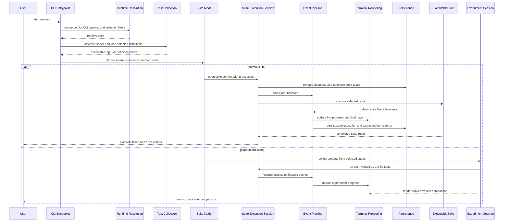

# Rue CLI

The CLI is glue. It turns user intent into a suite plan, opens the right runtime
contexts, wires event processors, and gets out of the way. Suite execution,
discovery, storage, telemetry, and rendering all stay in their own lanes.

## Shape

- `__init__.py`: Typer app wiring. Bare `rue` shows help. No hidden run alias.
- `options.py`: shared option types and selection resolution. If a flag changes
  what tests execute, normalize it here.
- `run.py`: the main traffic cop for `rue run` and `rue run -exp`.
- `status/`: dry-run inspection. Builds the same kind of test tree users will
  run, but does not execute test bodies.
- `db.py`: database lifecycle UX: status, init, reset.
- `init.py`: one job: register the pytest entry point.
- `rendering/`: every terminal view, style, Rich renderer, and live output
  adapter. If it decides how something looks, it goes here.

## Execution Pattern

Command modules do orchestration:

1. load config
2. merge CLI overrides
3. discover/load tests
4. pick suite mode
5. open contexts
6. call domain services
7. exit with the right code

Rendering modules do presentation:

1. adapt domain objects into view models
2. own Rich layout and styling
3. keep live terminal state
4. print final reports

Do not mix those. If `run.py` starts building Rich trees or tables, that is a
smell. If rendering starts mutating suite execution or storage state, also a
smell.

## Rendering Package

- `primitives.py`: tiny shared formatting atoms: status styles, paths, text.
- `tests.py`: shared test tree report models and renderer.
- `suite.py`: suite header, summary, execution lines, failure panels.
- `metrics.py`: metric overview and verbose breakdowns.
- `experiments.py`: experiment progress and final variant comparison.
- `live.py`: verbosity modes for live suite output.
- `terminal.py`: terminal event adapters plus Rich Live session ownership.
- `errors.py`: CLI error display.

Imports should point to the owning module directly. No compatibility shims, no
old aliases, no “just in case” re-exports.

## Suite Lifecycle

## UX Contract

The CLI should feel boring in the best way:

- explicit commands: `rue run`, `rue status`, `rue db`
- stable verbosity behavior: quiet is compact, default is scannable, verbose is
  diagnostic
- live output never fights user stdout/stderr
- failed assertions and exceptions stay easy to find
- metrics and experiments preserve useful detail without flooding default output
- status tells users what will run and what resolution problems exist before
  they spend time running it

## Status

`rue status` is a preflight. It uses the same selection path as `rue run`, builds
executable test trees, compiles resource graphs, and resolves dependencies far
enough to show injected resource types. Dependency issues become tree issues.
Definition errors still stop the command because the suite shape is invalid.

## Experiments

`rue run -exp` shares collection and config resolution with normal suites, then
splits into variant child suites. `TerminalExperimentReporter` owns live progress;
`ExperimentRenderer` owns the final comparison. `--suite-execution-id` and `--maxfail` are
rejected because one CLI invocation fans out into multiple child suites.

## Extension Points

- Custom processors are registered `SuiteEventsProcessor` instances selected by
  `--processor` or `config.processors`.
- The CLI always attaches `TerminalSuiteReporter` for normal terminal output.
- The CLI appends `TursoSuiteRecorder` so official suites persist by default.
- `OtelReporter` attaches when `Config.otel` is true.

## House Rules

- Add new terminal UX under `rue.cli.rendering`.
- Reuse existing report/view models before inventing another model.
- Keep command files as control flow, not view code.
- Keep live mutability in `TerminalSuiteState` or `ExperimentSuiteState`.
- Break imports cleanly when architecture changes. No ghost modules.
- Prefer boring, predictable output over clever terminal tricks.
