# Runtime Context SPEC

**Status:** Draft
**Intended use:** Normative contract for Rue runtime context scopes

## Why This Exists

Rue runtime APIs depend on ambient context scopes. A run context exists before
runners are constructed or called. A test context exists before a test body or a
test-scoped resource is executed. Resource, metric, patching, tracing, and
collector code use these contexts as runtime ownership, metadata, and result
sinks.

This file makes that contract explicit. It documents which contexts exist, when
they are available, and how new context APIs should be designed.

The key words **MUST**, **MUST NOT**, **SHOULD**, **SHOULD NOT**, and **MAY**
are normative.

## Runtime Lifecycle

The first row is the Rue lifecycle sequence. Every later row is a runtime
context lifetime. Explicit `space:N` blocks keep each lifetime aligned to the
stage where that context becomes available.

```mermaid
%%{init: {"themeVariables": {"fontSize": "16px", "fontFamily": "ui-sans-serif, system-ui, sans-serif"}}}%%
block-beta
  columns 12

  cli["CLI selection<br/>rue.cli.tests.run.run<br/>resolve_selection"]
  collect["Static collection<br/>TestSpecCollector<br/>.build_spec_collection"]
  load["Definition loading<br/>TestLoader<br/>.load_from_collection"]
  runner["Runner setup<br/>Runner.__init__<br/>Runner.run"]
  schedule["Schedule build<br/>Runner._execute_run<br/>DefaultTestFactory.build"]
  graphs["Graph compile<br/>ResourceRegistry<br/>.compile_graphs"]
  dispatch["Step dispatch<br/>Runner._run_step<br/>ExecutableTest.execute"]
  resolve_deps["Dependency resolve<br/>DependencyResolver<br/>.resolve_graph_deps"]
  user_call["User test call<br/>LoadedTestDef<br/>.call_test_fn"]
  test_done["Test cleanup<br/>DependencyResolver<br/>.teardown(Scope.TEST)"]
  module_done["Module cleanup<br/>Runner<br/>._teardown_module_if_complete"]
  final["Run result<br/>DependencyResolver.teardown()<br/>Store.save_run"]

  space:3
  run_ctx["RunContext<br/>CURRENT_RUN_CONTEXT<br/>config, run_id, environment"]:9

  space:3
  run_owner["ScopeContext<br/>RUN owner"]:9

  space:3
  metric_sink["CURRENT_METRIC_RESULTS<br/>run-level metric sink"]:9

  space:4
  process_pool["LazyProcessPool<br/>subprocess executor holder"]:7
  space

  space:6
  test_ctx["TestContext<br/>CURRENT_TEST<br/>loaded item, execution id"]:4
  space:2

  space:6
  test_owner["ScopeContext<br/>TEST and MODULE owners"]:4
  space:2

  space:6
  tracer["CURRENT_TEST_TRACER<br/>test tracer binding"]:4
  space:2

  space:7
  patch_resolve["PatchStore<br/>resource resolve"]
  space
  patch_test["PatchStore<br/>test teardown"]
  patch_module["PatchStore<br/>module teardown"]
  patch_run["PatchStore<br/>run teardown"]

  space:7
  hook_resolve["ResourceHookContext<br/>on_resolve / on_injection"]
  space
  hook_test["ResourceHookContext<br/>test on_teardown"]
  hook_module["ResourceHookContext<br/>module on_teardown"]
  hook_run["ResourceHookContext<br/>run on_teardown"]

  space:8
  assertions["CURRENT_ASSERTION_RESULTS<br/>assertion sink"]
  space:3

  space:8
  predicates["CURRENT_PREDICATE_RESULTS<br/>assertion rewrite sink"]
  space:3

  space:8
  assertion_metrics["ACTIVE_ASSERTION_METRICS<br/>metrics() block"]
  space:3

  space:8
  sut_spans["CURRENT_SUT_SPAN_IDS<br/>SUT tracing stack"]
  space:3

  style cli fill:#f8fafc,stroke:#475569,color:#111827
  style collect fill:#f8fafc,stroke:#475569,color:#111827
  style load fill:#f8fafc,stroke:#475569,color:#111827
  style runner fill:#f8fafc,stroke:#475569,color:#111827
  style schedule fill:#f8fafc,stroke:#475569,color:#111827
  style graphs fill:#f8fafc,stroke:#475569,color:#111827
  style dispatch fill:#f8fafc,stroke:#475569,color:#111827
  style resolve_deps fill:#f8fafc,stroke:#475569,color:#111827
  style user_call fill:#f8fafc,stroke:#475569,color:#111827
  style test_done fill:#f8fafc,stroke:#475569,color:#111827
  style module_done fill:#f8fafc,stroke:#475569,color:#111827
  style final fill:#f8fafc,stroke:#475569,color:#111827
  style run_ctx fill:#eff6ff,stroke:#2563eb,color:#111827
  style run_owner fill:#eff6ff,stroke:#2563eb,color:#111827
  style metric_sink fill:#f0fdf4,stroke:#16a34a,color:#111827
  style process_pool fill:#fffbeb,stroke:#d97706,color:#111827
  style test_ctx fill:#f5f3ff,stroke:#7c3aed,color:#111827
  style test_owner fill:#f5f3ff,stroke:#7c3aed,color:#111827
  style tracer fill:#ecfeff,stroke:#0891b2,color:#111827
  style assertions fill:#f0fdf4,stroke:#16a34a,color:#111827
  style predicates fill:#f0fdf4,stroke:#16a34a,color:#111827
  style assertion_metrics fill:#f0fdf4,stroke:#16a34a,color:#111827
  style sut_spans fill:#ecfeff,stroke:#0891b2,color:#111827
  style patch_resolve fill:#fef2f2,stroke:#dc2626,color:#111827
  style patch_test fill:#fef2f2,stroke:#dc2626,color:#111827
  style patch_module fill:#fef2f2,stroke:#dc2626,color:#111827
  style patch_run fill:#fef2f2,stroke:#dc2626,color:#111827
  style hook_resolve fill:#fff7ed,stroke:#ea580c,color:#111827
  style hook_test fill:#fff7ed,stroke:#ea580c,color:#111827
  style hook_module fill:#fff7ed,stroke:#ea580c,color:#111827
  style hook_run fill:#fff7ed,stroke:#ea580c,color:#111827
```

Static collection and loading happen before Rue opens runtime contexts. They
produce `TestSpecCollection` and `LoadedTestDef` values that execution later
uses under `RunContext` and `TestContext`.

`RunContext` opens run ownership. `TestContext` layers test and module
ownership on top of the active run. Rue MUST NOT resolve `Scope.TEST` or
`Scope.MODULE` ownership unless a `TestContext` is open.

## Context Catalogue

| Context API | Purpose | Binder / owner | Available during | Required behavior | Main consumers |
| --- | --- | --- | --- | --- | --- |
| `RunContext` / `CURRENT_RUN_CONTEXT` | Run-level config, run id, environment, experiment variant metadata | Opened by CLI, experiment runner, status builder, or tests before constructing/calling runner APIs | Whole Rue run | Required; missing lookup MUST fail | `Runner`, `SingleTest`, assertions, run event processors, subprocess payloads |
| `RunEnvironment` | Serializable metadata for the process that owns the run | Built by `RunContext` | As `RunContext.environment` | Not a context binding | Run result persistence and reports |
| `TestContext` / `CURRENT_TEST` | Current loaded test definition and execution id | Opened by `SingleTest._execute`, subprocess worker, and status preflight | One test execution or synthetic module teardown selection | Required for test execution, graph lookup, SUT injection, and test/module-scoped resources | `LoadedTestDef`, `DependencyResolver`, SUT resources, transfer |
| `ScopeContext` / `CURRENT_SCOPE_CONTEXT` | Current `ScopeOwner` values for `Scope.RUN`, `Scope.MODULE`, and `Scope.TEST` | Opened by `RunContext` and replaced by `TestContext` | Run context for `RUN`; test context for all scopes | Required for scoped resources and patches; invalid scope ownership MUST fail | Resource store, resolver, patch dispatch |
| `ResourceHookContext` / `CURRENT_RESOURCE_HOOK_CONTEXT` | Consumer/provider metadata while resource hooks run | Opened by `DependencyResolver` around `on_resolve`, `on_injection`, and `on_teardown` | Resource hook callbacks only | Required inside hook-only APIs | Metric resource decoration and hook metadata |
| `CURRENT_ASSERTION_RESULTS` | Optional assertion result sink | Bound with `bind` around loaded test execution or metric execution | Test body and metric collection windows | Optional; `None` means no collection | `AssertionResult.__post_init__`, metrics |
| `CURRENT_PREDICATE_RESULTS` | Optional predicate result sink for rewritten assertions | Bound with `bind` by assertion rewrite | Predicate calls inside an assertion | Optional; `None` means no collection | `@predicate` wrappers |
| `CURRENT_METRIC_RESULTS` | Optional run-level metric result sink | Bound with `bind` by `Runner.run` | Whole executable run body | Optional; `None` means no collection | `MetricResult.__post_init__` |
| `CURRENT_TEST_TRACER` | Optional active test tracer | Bound with `bind` by local and subprocess test execution | Test execution | Optional; `None` means tracing is inactive | predicates, SUT resources, telemetry |
| `CURRENT_SUT_SPAN_IDS` | Optional stack of active SUT span ids | Bound with `bind` by SUT tracing wrappers | Nested SUT calls | Optional; empty tuple means no active SUT span | OpenTelemetry runtime |
| `LazyProcessPool` / `CURRENT_PROCESS_POOL` | Runner-owned lazy subprocess pool | Opened by `Runner._execute_run` | Queue execution for a run | Required through `LazyProcessPool.current()` when subprocess execution is requested | `SingleTest._execute_subprocess` |
| `PatchStore` | Resolver-owned storage for context-routed monkeypatch handles | Opened by `DependencyResolver` while resolving or tearing down resources | Resource resolution and teardown | Required for `MonkeyPatch.for_scope`; missing lookup MUST fail | `MonkeyPatch`, resolver patch cleanup, dispatchers |
| `ACTIVE_ASSERTION_METRICS` | Optional metric objects that record assertion pass/fail values | Bound by `metrics()` | User-selected assertion metric block | Optional; `None` means no metric recording | `AssertionResult.__post_init__` |

`PatchStore` lives in `src/rue/patching/runtime.py` because patch behavior owns
the storage and dispatch API. It is still a runtime context and MUST follow the
same lookup and lifecycle rules.

`ACTIVE_ASSERTION_METRICS` lives in `src/rue/resources/metrics/scope.py` because
it is a metric resource feature, not a cross-runtime ownership scope.

## Lifecycle Constraints

`Runner` construction and execution require an open `RunContext`.

`SingleTest` construction requires an open `RunContext` because it builds a
test tracer from run config and run id.

`TestContext` requires an open `RunContext`; entering it derives run, module,
and test `ScopeOwner` values from the active run and loaded test.

`Scope.RUN` ownership is available inside `RunContext`. `Scope.MODULE` and
`Scope.TEST` ownership are available only inside `TestContext`.

Resource graph lookup without an explicit graph requires `CURRENT_TEST` because
graphs are keyed by execution id.

Subprocess execution requires `LazyProcessPool` to be open in the runner and
reopens serialized `RunContext` and `TestContext` inside the worker process.

Module teardown may temporarily open `TestContext` for a completed execution so
`ScopeContext.current_owner(Scope.MODULE)` selects the correct module owner.

Run teardown MUST clean remaining resource owners and patches before
`RunContext` exits.
