# Runtime Context SPEC

**Status:** Draft
**Intended use:** Normative contract for Rue suite execution context scopes

## Why This Exists

Rue suite execution APIs depend on ambient context scopes. A suite context
exists before suite execution objects are constructed or called. A test context
exists before a test body or a test-scoped resource is executed. Resource, metric,
patching, tracing, and
collector code use these contexts as runtime ownership, metadata, and result
sinks.

This file makes that contract explicit. It documents which contexts exist, when
they are available, and how new context APIs should be designed.

The key words **MUST**, **MUST NOT**, **SHOULD**, **SHOULD NOT**, and **MAY**
are normative.

## Runtime Lifecycle

The first row is the Rue lifecycle sequence. Every later row is a runtime
context lifetime. Explicit `space:N` blocks keep each lifetime aligned to the
stage where that context becomes available.

```mermaid
%%{init: {"themeVariables": {"fontSize": "16px", "fontFamily": "ui-sans-serif, system-ui, sans-serif"}}}%%
block-beta
  columns 12

  cli["CLI selection<br/>rue.cli.run.run<br/>resolve_selection"]
  collect["Static collection<br/>TestSpecCollector<br/>.collect_test_specs"]
  load["Definition loading<br/>TestLoader<br/>.load_tests"]
  suite_exec["Suite setup<br/>ExecutableSuite<br/>.execute"]
  schedule["Schedule build<br/>ExecutableSuite._execute_suite<br/>DefaultTestFactory.build"]
  graphs["Graph compile<br/>ResourceRegistry<br/>.compile_graphs"]
  dispatch["Step dispatch<br/>ExecutableSuite._execute_step<br/>ExecutableTest.execute"]
  resolve_deps["Dependency resolve<br/>DependencyResolver<br/>.resolve_graph_deps"]
  user_call["User test call<br/>LoadedTestDef<br/>.call_test_fn"]
  test_done["Test cleanup<br/>DependencyResolver<br/>.teardown(Scope.TEST)"]
  module_done["Module cleanup<br/>ExecutableSuite + ModuleContext<br/>teardown(Scope.MODULE)"]
  final["Suite result<br/>DependencyResolver.teardown()<br/>TursoSuiteRecorder.on_suite_execution_complete"]

  space:3
  suite_ctx["SuiteContext<br/>CURRENT_SUITE_CONTEXT<br/>config, suite_execution_id, host"]:9

  space:3
  suite_owner["ScopeContext<br/>SUITE owner"]:9

  space:3
  metric_sink["CURRENT_METRIC_RESULTS<br/>suite-level metric sink"]:9

  space:4
  process_pool["LazyProcessPool<br/>subprocess executor holder"]:7
  space

  space:6
  test_ctx["TestContext<br/>CURRENT_TEST<br/>test_execution_id"]:4
  space:2

  space:6
  test_owner["ScopeContext<br/>TEST owner"]:4
  space:2

  space:6
  tracer["CURRENT_TEST_TRACER<br/>test tracer binding"]:4
  space:2

  space:7
  patch_resolve["PatchStore<br/>resource resolve"]
  space
  patch_test["PatchStore<br/>test teardown"]
  patch_module["PatchStore<br/>module teardown"]
  patch_suite["PatchStore<br/>suite teardown"]

  space:7
  hook_resolve["ResourceHookContext<br/>on_resolve / on_injection"]
  space
  hook_test["ResourceHookContext<br/>test on_teardown"]
  hook_module["ResourceHookContext<br/>module on_teardown"]
  hook_suite["ResourceHookContext<br/>suite on_teardown"]

  space:8
  assertions["CURRENT_ASSERTION_RESULTS<br/>assertion sink"]
  space:3

  space:8
  predicates["CURRENT_PREDICATE_RESULTS<br/>assertion rewrite sink"]
  space:3

  space:8
  assertion_metrics["ACTIVE_ASSERTION_METRICS<br/>metrics() block"]
  space:3

  space:8
  sut_spans["CURRENT_SUT_SPAN_IDS<br/>SUT tracing stack"]
  space:3

  style cli fill:#f8fafc,stroke:#475569,color:#111827
  style collect fill:#f8fafc,stroke:#475569,color:#111827
  style load fill:#f8fafc,stroke:#475569,color:#111827
  style suite_exec fill:#f8fafc,stroke:#475569,color:#111827
  style schedule fill:#f8fafc,stroke:#475569,color:#111827
  style graphs fill:#f8fafc,stroke:#475569,color:#111827
  style dispatch fill:#f8fafc,stroke:#475569,color:#111827
  style resolve_deps fill:#f8fafc,stroke:#475569,color:#111827
  style user_call fill:#f8fafc,stroke:#475569,color:#111827
  style test_done fill:#f8fafc,stroke:#475569,color:#111827
  style module_done fill:#f8fafc,stroke:#475569,color:#111827
  style final fill:#f8fafc,stroke:#475569,color:#111827
  style suite_ctx fill:#eff6ff,stroke:#2563eb,color:#111827
  style suite_owner fill:#eff6ff,stroke:#2563eb,color:#111827
  style metric_sink fill:#f0fdf4,stroke:#16a34a,color:#111827
  style process_pool fill:#fffbeb,stroke:#d97706,color:#111827
  style test_ctx fill:#f5f3ff,stroke:#7c3aed,color:#111827
  style test_owner fill:#f5f3ff,stroke:#7c3aed,color:#111827
  style tracer fill:#ecfeff,stroke:#0891b2,color:#111827
  style assertions fill:#f0fdf4,stroke:#16a34a,color:#111827
  style predicates fill:#f0fdf4,stroke:#16a34a,color:#111827
  style assertion_metrics fill:#f0fdf4,stroke:#16a34a,color:#111827
  style sut_spans fill:#ecfeff,stroke:#0891b2,color:#111827
  style patch_resolve fill:#fef2f2,stroke:#dc2626,color:#111827
  style patch_test fill:#fef2f2,stroke:#dc2626,color:#111827
  style patch_module fill:#fef2f2,stroke:#dc2626,color:#111827
  style patch_suite fill:#fef2f2,stroke:#dc2626,color:#111827
  style hook_resolve fill:#fff7ed,stroke:#ea580c,color:#111827
  style hook_test fill:#fff7ed,stroke:#ea580c,color:#111827
  style hook_module fill:#fff7ed,stroke:#ea580c,color:#111827
  style hook_suite fill:#fff7ed,stroke:#ea580c,color:#111827
```

Static collection and loading happen before Rue opens runtime contexts. They
produce `SuiteSpec` and `LoadedTestDef` values that suite execution later uses
under `SuiteContext`, `ModuleContext`, and `TestContext`.

`SuiteContext` opens suite ownership. `ModuleContext` layers module ownership on
top of the active suite. `TestContext` layers test and module ownership on top of
the active suite. Rue MUST NOT resolve `Scope.TEST` unless a `TestContext` is
open, and MUST NOT resolve `Scope.MODULE` unless a `ModuleContext` or
`TestContext` is open.

## Context Catalogue

| Context API | Purpose | Binder / owner | Available during | Required behavior | Main consumers |
| --- | --- | --- | --- | --- | --- |
| `SuiteContext` / `CURRENT_SUITE_CONTEXT` | Suite-level config, `suite_execution_id`, environment, process kind, experiment variant metadata | Opened by CLI, experiment execution, status builder, or tests before constructing/calling execution APIs | Whole Rue suite | Required; missing lookup MUST fail | `ExecutableSuite`, `SingleTest`, assertions, suite event processors, subprocess payloads |
| `SuiteHost` | Serializable metadata for the process that owns the suite | Built by `SuiteContext` | As `SuiteContext.host` | Not a context binding | Suite result persistence and reports |
| `ModuleContext` | Current module path without test metadata | Opened by `ExecutableSuite` around top-level module work and module teardown | Top-level test dispatch and module teardown | Required for module-scoped resources and patches outside a test body | `ExecutableSuite`, `DependencyResolver`, patch dispatch |
| `TestContext` / `CURRENT_TEST` | Current `test_execution_id` | Opened by `SingleTest._execute`, subprocess worker, and status preflight | One test execution | Required for test execution, graph lookup, SUT injection, and test-scoped resources | `LoadedTestDef`, `DependencyResolver`, SUT resources, transfer |
| `ScopeContext` / `CURRENT_SCOPE_CONTEXT` | Current `ScopeOwner` values for `Scope.SUITE`, `Scope.MODULE`, and `Scope.TEST` | Opened by `SuiteContext`, `ModuleContext`, and `TestContext` | Suite context for `SUITE`; module context for `MODULE`; test context for `TEST` plus active wider owners | Required for scoped resources and patches; invalid scope ownership MUST fail | Resource store, resolver, patch dispatch |
| `ResourceHookContext` / `CURRENT_RESOURCE_HOOK_CONTEXT` | Consumer/provider metadata while resource hooks run | Opened by `DependencyResolver` around `on_resolve`, `on_injection`, and `on_teardown` | Resource hook callbacks only | Required inside hook-only APIs | Metric resource decoration and hook metadata |
| `CURRENT_ASSERTION_RESULTS` | Optional assertion result sink | Bound with `bind` around loaded test execution or metric collection | Test body and metric collection windows | Optional; `None` means no collection | `AssertionResult.__post_init__`, metrics |
| `CURRENT_PREDICATE_RESULTS` | Optional predicate result sink for rewritten assertions | Bound with `bind` by assertion rewrite | Predicate calls inside an assertion | Optional; `None` means no collection | `@predicate` wrappers |
| `CURRENT_METRIC_RESULTS` | Optional suite-level metric result sink | Bound with `bind` by `ExecutableSuite.execute` | Whole executable suite body | Optional; `None` means no collection | `MetricResult.__post_init__` |
| `CURRENT_TEST_TRACER` | Optional active test tracer | Bound with `bind` by local and subprocess test execution | Test execution | Optional; `None` means tracing is inactive | predicates, SUT resources, telemetry |
| `CURRENT_SUT_SPAN_IDS` | Optional stack of active SUT span ids | Bound with `bind` by SUT tracing wrappers | Nested SUT calls | Optional; empty tuple means no active SUT span | OpenTelemetry runtime |
| `LazyProcessPool` / `CURRENT_PROCESS_POOL` | ExecutableSuite-owned lazy subprocess pool | Opened by `ExecutableSuite._execute_suite` | Queue execution for a suite | Required through `LazyProcessPool.current()` when subprocess execution is requested | `SingleTest._execute_subprocess` |
| `PatchStore` | Resolver-owned storage for context-routed monkeypatch handles | Opened by `DependencyResolver` while resolving or tearing down resources | Resource resolution and teardown | Required for `MonkeyPatch.for_scope`; missing lookup MUST fail | `MonkeyPatch`, resolver patch cleanup, dispatchers |
| `ACTIVE_ASSERTION_METRICS` | Optional metric objects that record assertion pass/fail values | Bound by `metrics()` | User-selected assertion metric block | Optional; `None` means no metric recording | `AssertionResult.__post_init__` |

`PatchStore` lives in `src/rue/patching/runtime.py` because patch behavior owns
the storage and dispatch API. It is still a runtime context and MUST follow the
same lookup and lifecycle rules.

`ACTIVE_ASSERTION_METRICS` lives in `src/rue/resources/metrics/scope.py` because
it is a metric resource feature, not a cross-runtime ownership scope.

## Lifecycle Constraints

`ExecutableSuite` construction and suite execution require an open
`SuiteContext`.

`SingleTest` construction requires an open `SuiteContext` because it builds a
test tracer from suite config and `test_execution_id`.

`ModuleContext` requires an open `SuiteContext`; entering it derives suite and
module `ScopeOwner` values from the active suite and module path without binding
`CURRENT_TEST`.

`TestContext` requires an open `SuiteContext`; entering it layers a test
`ScopeOwner` over the active scope context.

`Scope.SUITE` ownership is available inside `SuiteContext`. `Scope.MODULE`
ownership is available inside `ModuleContext`. `TestContext` preserves the
active module owner when one is already bound. `Scope.TEST` ownership is
available only inside `TestContext`.

Resource graph lookup without an explicit graph requires `CURRENT_TEST` because
graphs are keyed by `test_execution_id`.

Subprocess test execution requires `LazyProcessPool` to be open in the
executable suite and reopens serialized `SuiteContext` and `TestContext` inside
the worker process. Normal resources are resolved and torn down inside the
process that needs them. Only resources opted into `subprocess_sync` transport
state back to the parent resolver. `SuiteContext.process` identifies whether
the active suite is running in the main process, a test subprocess, or an
experiment subprocess.

Module teardown opens `ModuleContext` for the completed module so
`ScopeContext.current_owner(Scope.MODULE)` selects the correct module owner
without exposing fake test metadata.

Suite teardown MUST clean remaining resource owners and patches before
`SuiteContext` exits.
