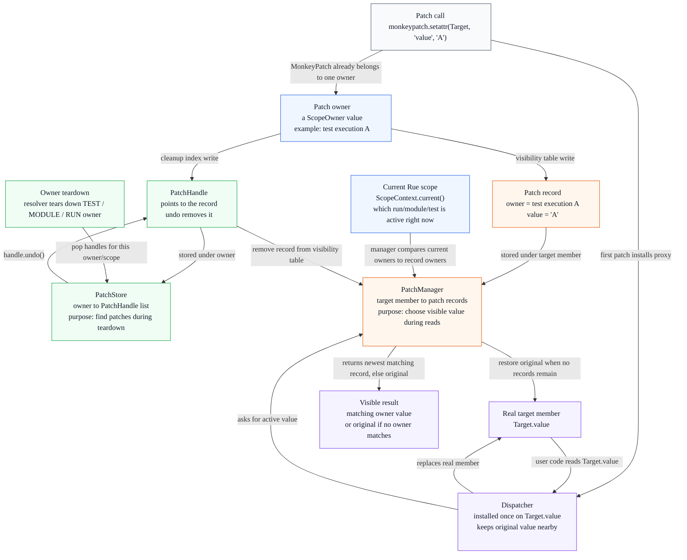

# Runtime Patching SPEC

**Status:** Draft
**Intended use:** Short map of Rue's scoped monkeypatch runtime

Rue patching gives users pytest-like monkeypatch ergonomics with Rue scope
ownership. A target is patched once with a dispatcher, but the visible value is
chosen from the active `ScopeContext`, so concurrent tests can patch the same
object without seeing each other's values.

## User Story

Users ask for `monkeypatch` like any other Rue resource:

```python
import rue


class Target:
    value = "original"


@rue.test
def test_value(monkeypatch):
    monkeypatch.setattr(Target, "value", "patched")
    assert Target.value == "patched"
```

The built-in `monkeypatch` resource is registered for every `Scope`. Test
functions receive a test-scoped patcher. Resource factories receive a patcher
matching the resource scope, so setup can patch for `test`, `module`, or `run`
lifetime.

Patches are undone by Rue teardown, not by user cleanup code. Test patches end
at `Scope.TEST` teardown, module patches at `Scope.MODULE` teardown, and run
patches at final resolver teardown. Experiment hooks use the same API directly
with `MonkeyPatch.for_scope(Scope.RUN)`.

## Runtime Model

Four concepts matter:

- **Patch owner**: the `ScopeOwner` that owns this patch. It answers both
  "when should this patch be undone?" and "when is this value visible?"
- **PatchStore**: the resolver-owned cleanup index. It maps owner to handles so
  teardown can find patches to undo.
- **PatchManager**: the process-global visibility table. It maps target member
  to patch records so reads can choose the right value.
- **Dispatcher**: the object installed on the real target member. It delegates
  reads to `PatchManager` instead of storing one global patched value.

A patch is written to two places on purpose: `PatchStore` for teardown,
`PatchManager` for reads.



Example: if test A and test B both patch `Target.value`, they create two
records under the same `PatchManager` target entry. The records differ by
owner. While test A is active, `ScopeContext.current()` contains test owner A,
so the dispatcher returns A's value. While test B is active, it returns B's
value. After each owner tears down, `PatchStore` supplies that owner's handles
and the matching records disappear.

## API Map

| API | Role |
| --- | --- |
| `MonkeyPatch` | User-facing scoped patch API. |
| `MonkeyPatch.for_scope(scope)` | Creates a patcher for the current `ScopeOwner` and bound `PatchStore`. |
| `PatchStore` | Resolver-bound handle store keyed by `ScopeOwner`. |
| `PatchLifetime` | Couples one owner with the store used to register handles. |
| `PatchHandle` | Undo token for one patch record. |
| `PatchManager` | Installs dispatchers, stores target records, and resolves active values. |

## Operations

- `setattr(target, name, value)` patches an object attribute.
- `setattr("pkg.mod.attr", value)` patches by import path.
- `delattr(target, name)` makes an attribute look missing in the active owner.
- `setitem(mapping, key, value)` patches a mapping item.
- `delitem(mapping, key)` makes a mapping item look missing in the active owner.
- `setitem(sequence, value, idx=..., replace=...)` patches or inserts a sequence
  item.
- `delitem(sequence, idx=..., replace=...)` deletes a sequence item for the
  active owner.

## Core Rules

- Patch visibility is context-routed, not globally replaced per test.
- `PatchStore.current()` is required; patching only works inside resolver flows
  or explicit experiment patch application.
- A dispatcher is installed once per target member. Later patches append records
  for different owners.
- Active lookup walks records newest-first and returns the first record owned by
  the current run, module, or test owner for that record's scope.
- Missing-value patches use the same dispatch path and raise
  `AttributeError`, `KeyError`, or `IndexError` when selected.
- Undo removes handles in reverse teardown order. The original value is restored
  only after the final record for that target member is removed.
- Built-in `monkeypatch` is `sync=False`; subprocess workers create their own
  scoped patch state instead of syncing patch handles across process boundaries.
