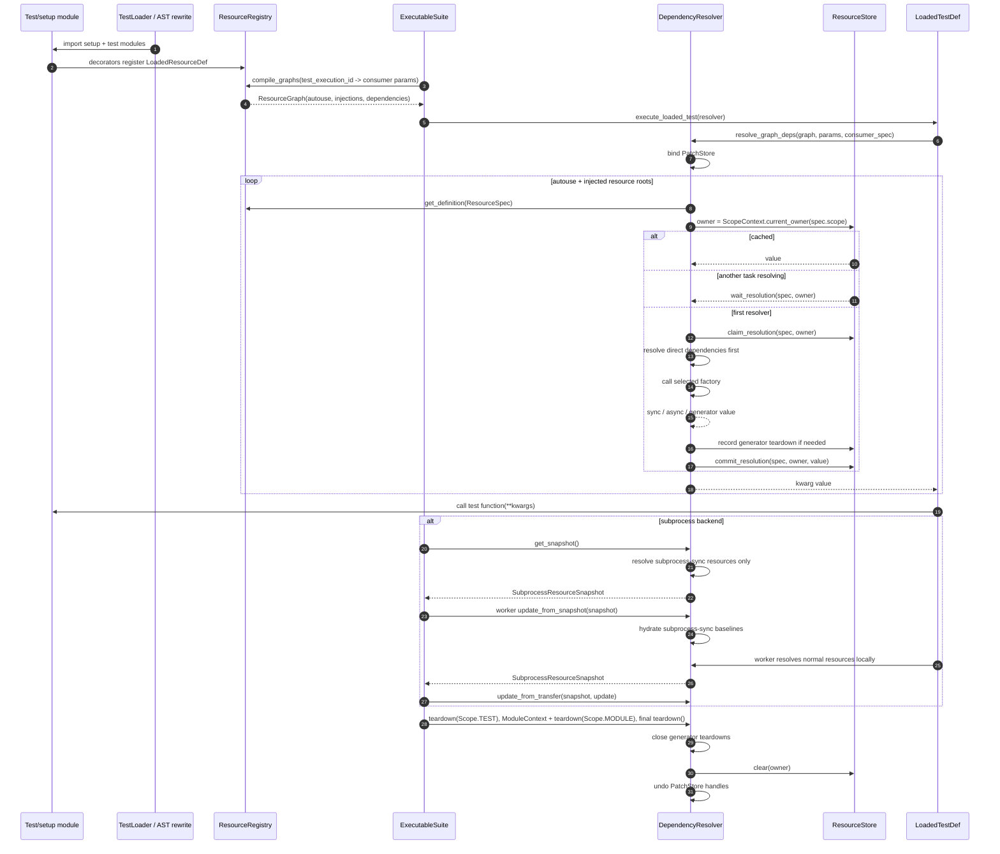

# Resource DI SPEC

**Status:** Draft
**Intended use:** Short map of Rue's dependency injection runtime

Rue resources are named providers selected at graph-compile time and owned at
runtime by `ScopeOwner`. Resolution returns kwargs for a consumer, caches
created values by scope owner, and tears generator resources down when that
owner ends.

## User Story

Resources are Rue's mirror of pytest fixtures. Users define named setup units
once and tests ask for them by parameter name. Rue also rewrites supported
top-level `pytest.fixture` declarations into resources while loading test
modules, so fixture-shaped setup can enter the same runtime.

```python
import rue


@rue.resource(scope="module")
def client():
    return APIClient()


@rue.test
def test_health(client):
    assert client.get("/health").ok
```

Users pick scope to express lifetime:

- `test`: fresh value per test execution; best for mutable or isolated state
- `module`: one value per test file; best for medium-cost shared setup
- `suite`: one value per active provider; best for expensive shared setup

Generator resources give users teardown without a second API:

```python
@rue.resource
def database():
    conn = connect()
    yield conn
    conn.close()
```

Setup files (`conftest.py`, `confrue_*.py`) let users provide shared resources
for a directory tree. Same-name providers may coexist; Rue selects the provider
nearest to the requesting test module.

Normal resources are process-local across subprocess boundaries. A subprocess
worker resolves normal resources from the registered factory in that worker,
and parent-owned normal resource state is never snapshotted or merged.

Specialized user-facing APIs are still resources: `@rue.metric` records quality
signals, `@rue.sut` wraps systems under test with tracing/output capture, and
the built-in `monkeypatch` and `environment` resources scope patches and
filesystem/env-var sandboxes to the active Rue owner. Resources that opt into
`subprocess_sync` must resolve to `SyncableResource` instances. Rue metrics
use that contract to aggregate records from subprocess tests. SUT resources
use the same contract with no arbitrary wrapped-instance state transfer;
Rue-owned trace/output state is scoped to the active test. The `environment`
builtin uses `subprocess_sync` to reflink-clone parent state into workers and
ship deltas back; see `src/rue/environment/SPEC.md` for the wire protocol.

## Hooks

Resource hooks are registered through `resource(..., on_resolve=...,
on_injection=..., on_teardown=...)`. They run with `ResourceHookContext` bound,
so hook code can see the consumer spec, provider spec, and direct provider
dependencies.

- `on_resolve(value)` fires after direct dependencies are resolved and the
  selected factory returns or yields its first value. It runs before the value is
  committed to `ResourceStore`, once per `(ResourceSpec, ScopeOwner)`.
- `on_injection(value)` fires after a cached or newly materialized value is
  selected for a consumer, just before it is returned in kwargs. It can run many
  times for the same cached value.
- `on_teardown(value)` fires during owner teardown for generator resources,
  after the generator's post-yield cleanup path runs and before the value leaves
  the store.

## Sequence



## API Map

| API | Role |
| --- | --- |
| `resource()` / `ResourceRegistry.register_resource()` | Register one provider function as a `LoadedResourceDef`. |
| `ResourceSpec` | Provider identity: locator plus `Scope`. |
| `ResourceGraph` | Per-test-execution concrete graph: autouse roots, injection roots, dependency edges, resolution order. |
| `DependencyResolver` | Runtime resolver, subprocess resource sync owner, teardown owner, and patch-store binder. |
| `ResourceStore` | Cache, pending futures, and teardown records per `ScopeOwner`. |
| `SyncableResource` | Resource value protocol for subprocess-safe state capture, hydration, and merge. |
| `ResourceHookContext` | Ambient metadata while resource hooks run. |
| `ModuleContext` | Runtime module owner used for top-level module work and module teardown. |

## Core Rules

- Registration happens while setup/test modules are imported; graph compilation
  happens after executable leaves and their params are known.
- Provider selection is concrete before test execution: by requested name,
  allowed scope, and nearest provider directory to the consumer module.
- Wider scopes cannot depend on narrower scopes. The current rule is encoded by
  `Scope.dependency_scopes`.
- Runtime ownership is not the provider path. Values are cached under
  `ScopeContext.current_owner(spec.scope)`, with module owners supplied by
  `ModuleContext` or `TestContext`.
- Only the first resolver task materializes a `(ResourceSpec, ScopeOwner)`;
  concurrent callers wait on the pending future.
- `PatchStore` is bound for resolution and teardown so `monkeypatch` resources
  can register handles against the active resource owner.
- Subprocess workers run normal resource resolution and teardown in the worker
  process. Only `subprocess_sync` resource state is returned to the parent.
