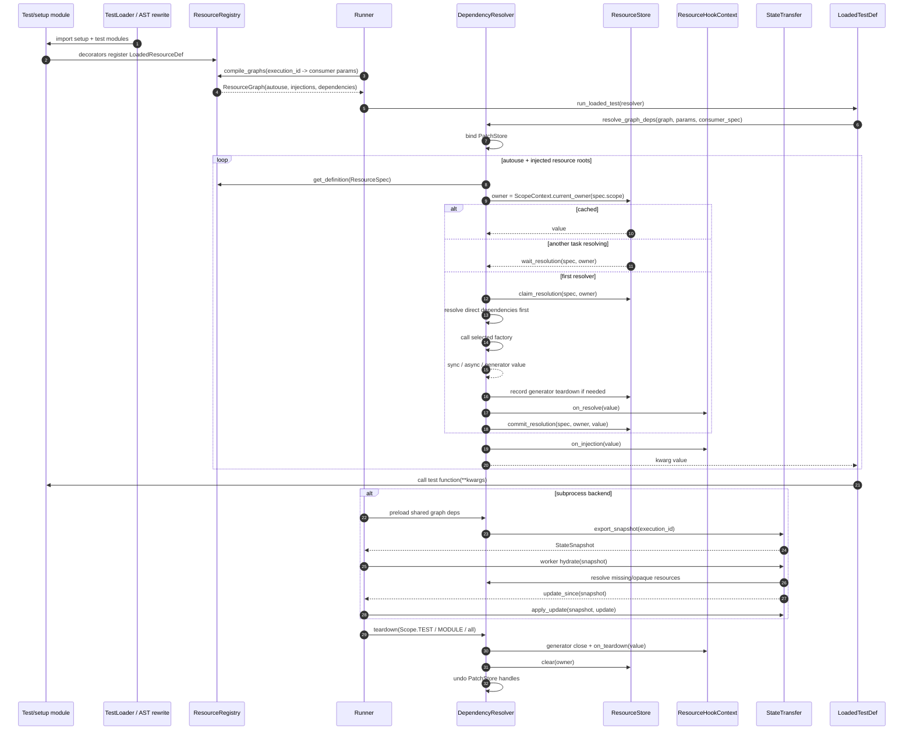

# Resource DI SPEC

**Status:** Draft
**Intended use:** Short map of Rue's dependency injection runtime

Rue resources are named providers selected at graph-compile time and owned at
runtime by `ScopeOwner`. Resolution returns kwargs for a test or hook, caches
created values by scope owner, and tears generator resources down when that
owner ends.

## Sequence

## API Map

| API | Role |
| --- | --- |
| `resource()` / `ResourceRegistry.register_resource()` | Register one provider function as a `LoadedResourceDef`. |
| `ResourceSpec` | Provider identity: locator plus `Scope`. |
| `ResourceGraph` | Per-execution concrete graph: autouse roots, injection roots, dependency edges, resolution order. |
| `DependencyResolver` | Runtime resolver, hook runner, teardown owner, and patch-store binder. |
| `ResourceStore` | Cache, pending futures, teardown records, and sync graph per `ScopeOwner`. |
| `StateTransfer` | Snapshot/hydrate/update path for subprocess execution. |
| `ResourceHookContext` | Ambient metadata for `on_resolve`, `on_injection`, and `on_teardown`. |

## Core Rules

- Registration happens while setup/test modules are imported; graph compilation
  happens after executable leaves and their params are known.
- Provider selection is concrete before execution: by requested name, allowed
  scope, and nearest provider directory to the consumer module.
- Wider scopes cannot depend on narrower scopes. The current rule is encoded by
  `Scope.dependency_scopes`.
- Runtime ownership is not the provider path. Values are cached under
  `ScopeContext.current_owner(spec.scope)`.
- Only the first resolver task materializes a `(ResourceSpec, ScopeOwner)`;
  concurrent callers wait on the pending future.
- `on_resolve` runs once for a freshly created value. `on_injection` runs every
  time the cached value is delivered to a consumer. `on_teardown` runs after the
  generator cleanup path for that owner.
- `PatchStore` is bound for resolution and teardown so `monkeypatch` resources
  can register handles against the active resource owner.
- Shadow stores hydrate subprocess state and skip live teardown; the parent
  applies worker updates back onto visible live resources.
